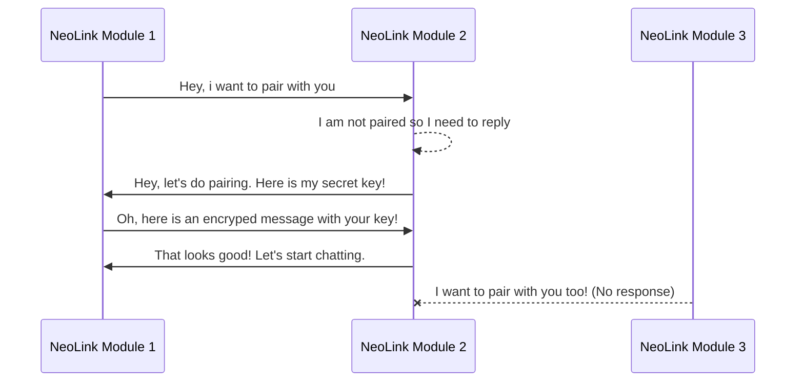
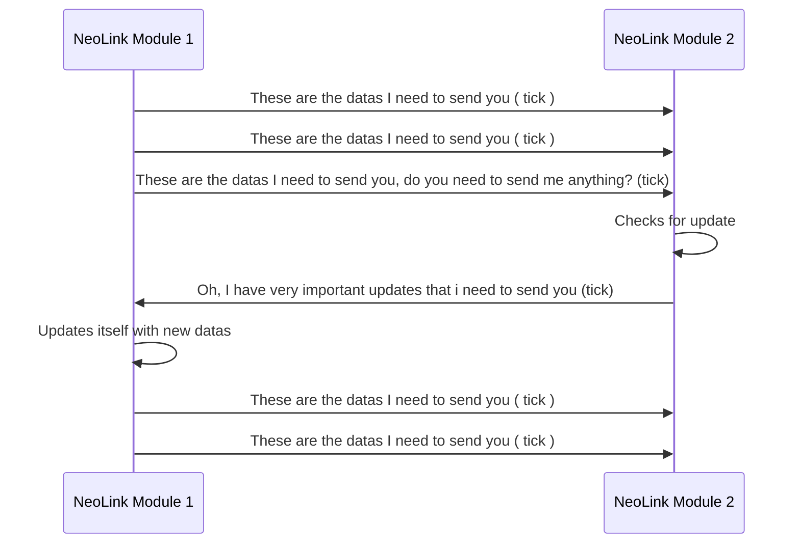

# NeoLink 2.4 Ghz Telemetry Module

NeoLink is a long-range radio telemetry module based on LoRa technology, operating in the 2.4GHz band.

NeoLink offers an impressive range, making it suitable for various telemetry applications that require data transmission over extended distances. Its long-range capabilities enable seamless communication between remote devices and centralized systems, even in challenging environments with obstacles or signal obstructions.

# Hardware

NeoLink module is used in conjunction with the Ebyte E28 (SX1280) module. To enhance its performance, it is equipped with a dual-core ESP32 processor (with WiFi mode disabled).

 - E28-2G4M27S
 - ESP32-WROOM-32D
 - 1W RF Power Amplifier

## Test and Results

| Antenna | Power (dB)|Range (Km)|
|--|--|--|
| Isotropic Antenna | 10dB | 5 Km (Maximum Range Test)|
|Yagi Antena with AeroWave Tracker| 10 dB | 5Km (within the city) |

The isotropic antenna test was conducted in an open area, in the outdoors. The Yagi antenna test, on the other hand, was performed within the city. **If additional comments are to be added, it should be noted that the Yagi antenna causes packet losses within the city.**

## How the System Works?

NeoLink is based on the Time Division Duplex (TDD) working principle. The module alternates between sending and listening to packets during specific time intervals. All these operations occur rapidly within a short time frame. On average, a 32 byte data is transmitted in approximately 10 - 25 milliseconds.

**This graph show how pairing works:**

**This graph show how data transmitting works:**

> In NeoLink, every **20ms** is considered as **one tick.**

and the loop continues...

## Safety Protections

 - AES-256 Encryption
 - Pair to Pair communication
 - Creating secret key with two modules to encrypt data.
 - Frequency Hopping Spread Spectrum (FHSS)

For suggestions, please contact us at : info@neostellar.net

## Updates

As Neo Stellar, we are still working on this project. As soon as we finish first alpha version of the project, we'll start uploading source code of this project.
